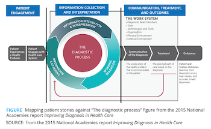
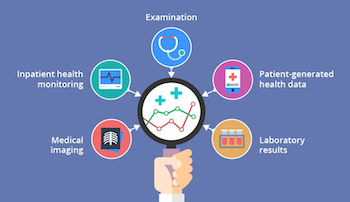
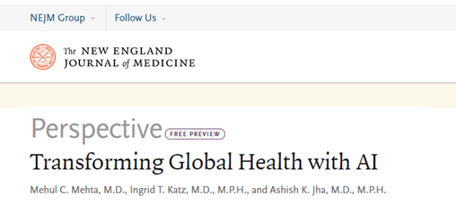
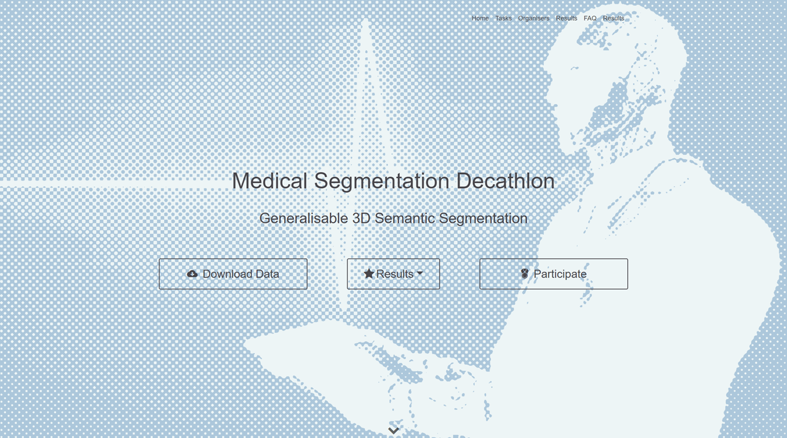
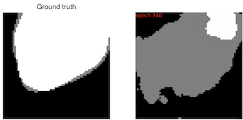
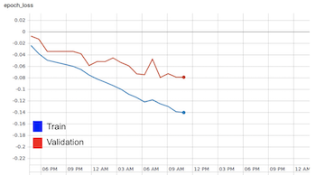

# 
 Pancreas tumor image segmentation 

### 
 UPC Artificial intelligence with Deep Learning Postgraduate Course 

##### 
 Students: Roger Borràs, Jaume Brossa, Cristina De La Torre, Cristian Pachón 

##### 
 Advisor: Santi Puch 

### Motivation
All of us are interested in biomedical applications and a central problem in health is the patient diagnostic process. This figure represents the general pipeline for patient diagnosis in health care:

    

* A first step, the engagement where a patient experiences a health problem
* Second, define the problem with medical data collection and interpretation
* And finally, treatment and evaluate the outcomes

For the data collection in patient diagnosis, there are different data sources like clinical examination, health monitoring, laboratory results and medical imaging. 

    

Medical imaging is a very important tool in diagnosis, and it will be more important in the future without any doubt. Our project is focused on apply Deep Learning to this kind of data to improve diagnosis. In a recent paper from New England journal of Medicine (NEJM), they suggest that neural networks has the potential to revolutionize health in the future.

    

### About Medical Segmentation Datathon
To practice this type of problems, we searched for data from Medical Segmentation Dechatlon Competition and we picked the pancreas tumor segmentation problem:

    

In this [link](http://medicaldecathlon.com/), there are all the details about panceas competition as well as other medical competitions.

### Input dataset
The input dataset for this task consists in **282 3D volume images** (for training and validation) of size **512 x 512 x number of slices**, each 3D image is composed by a specific number of slices (around 100) of size 512x512. The **modality** used to take these images was **computed tomography (CT)**. This modality takes images of the body from several angles in order to compose the final 3D image of this part scanned, in our case a volume of the thorax, place where pancreas could be found. 

These images have been acquired from the **Memorial Sloan Kettering Cancer Center** (MSK), a highly recognized institute focused on cancer research.

 

Normally in datasets like ImageNet, images have the *jpg* format or similar. However in this medical task,  the ***NifTI*** format is used. The NifTI format is commonly used in medical stuff, this format not only provide the image information (numpy array of the image) but also a header with metadata, where some relevant points were given. These relevant points consist mainly on the properties of the equipment where these images have been taken, data about the patient, etc. This information has been fundamental during years to radiologist in order to segment and see the images properly, so it will be also relevant for us to deal with this task successfully.

### Purpose of our project
Our purpose consists in **segment automatically** from a raw CT image of the thorax, the **pancreas** and its **tumor**. One example of **what we had** and **what we wanted to achieve** is presented in the following image. As we can see below, we had a raw image difficult to visualize at first sight and its label.

 

At first, these images have been preprocessed applying some special techniques normally used in CT medical images for machine and deep learning problems. Then we customized an input pipeline for these types of 3D medical images to finally pass them to a customized network, also prepared for 3D input images.

The result that we wanted to obtain, consisted of a 3D image segmented. This output, as you we see in the above image, have three different colors. Each color correspond to one structure presented on the raw image:

* Black, background
* White, pancreas
* Grey, pancreas tumor

So what we wanted during this project was to classify a 3D input image into this three different classes (background, pancreas and its tumor) and finally obtain a 3D output image with the pixels of this three different classes detected and labeled with its correspondent color.

### Challenges faced
As mention before, the input dataset consisted of 3D images. It meant that **a high amout of time** was needed to
train the model. Since the architecture of the net was quite complex (as it is explained in *Architecture* section), it took a lot of time **to make the model learn**. In this section, there are described the actions done in order to solve these problems.

#### High amout of time
It was observed the model needed a large amount of time to train. The first hyphotesis was the images were too big. In order to validate this hypotheis, we did the following changes:

* Resizing: It actually lowered the time needed but at the same time, a lot of information was lost. So, we decided not to use it

    

* Crop: Image crop along axes x, y and z. Relevant information was kept and input was smaller. We decided to used it

    

* Patches: Division of the the image into patches. It helped to solve computational problems. We decided to used it

    

#### Making the model learn
It was observed that the model was not learning, since it was assigning all the pixels to the backgroud class. After analysing the dataset, we saw the data was highly unbalanced. The following figures shows the raw image and the pancreas tumor:

    

    

As we can see, pancreas tumor is a really small portion of the image. We tested three hypothesis in order to see if the model was able to learn. These were:

* Use a problem-oriented loss function. A lot of papers mentioned the **Generalised Dice Loss** (GDL) was the indicated one to use for this problem. After using GLD the model started learning. The formula of this loss is the following one:

* Balance the data in order the have the same amount of pancreas class as backgraud class. This also helped the model to learn

* Data augmentation: In order to generate different samples of pancreas. Even though it was not necessary (becuase there were a lot of images), we implemented it to learn how to do these transformations

### Architecture
In this section, it is described the architecture of our proposal. This architecture is composed by two main parts:

* **Input pipeline**:  process where images should be modified and prepared to enter on our network properly 
* **Network**: process where our model learns and predicts the pancreas and its tumor segmentation

#### Input pipeline
As mentioned earlier, our input images consists of 3D CT medical images so we had to take this into account in order to manage them suitably. Before starting with the input pipeline, every CT medical image should be subjected to some changes, this changes are called **preprocessing**. Once images are preprocessed, these are prepared in the **input pipeline** to enter in the network.

During preprocessing, various techniques has been carried out in order to obtain an **improved image** and ready to enter on the model. The **main changes applied to these images** are the following:

* **Pixel spacing resampling**:
	 An special point taken into account was the pixel spacing in this 3D images. As we can see in the image below, we have the sizes of the pixels and the size of the voxel (distance between slices).  This pixel spacing depends on the scanner used, so in this way we could be dealing with images with different properties. It is important to keep the pixel spacing consistent or, on the contrary, it may be hard for our network to **generalize**. So, we wanted to have same sizes for all the images.

	We resampled all the images to a pixel spacing of type [1, 1, 1] . With this technique, a neural network will improve the predictions in different images since they will have the same spatial information and the kernels can learn this information in the same way.

	

	 
	

* **Windowing**:
		The intensities of grays in these types of medical images are not as usual as in normal images. Normal png files are usually in the standard range of 0-255 intensities values, while CT images can present  a high  range of intensities, from -1000 to 4000.
		
	This anormal range of intensities is due to the special unit of measurement in CT scans. This unit is the  **Hounsfield Unit**  **(HU)**  which is a measure of radiodensity. Each  **voxel**  (3D pixel) of a CT scan has an  **attenuation value**  that is the measure of the reduction intensity of a ray of light by the  **tissue**  through it passes. Each pixel is assigned to a numerical value called  **CT Number**, which is the average of all the attenuation values contained within the corresponding voxel. In the following image you will see this hounsfield scale, and some components or parts of the body are indicated, such as the pancreas.

	

	 
	

	
	Since neither we nor the machines can recognize 4000 shades of gray easily, a technique called **windowing** has been used to limit the number of Hounsfield units that are displayed. For example if we want to examine the soft tissue in one CT scan we can use a **minimum pixel value** of -135 and a **maximum pixel value** of 250, the tissues with CT numbers outside this range will appear either black or white. A narrow range provides a higher contrast.

	In our case, pancreas was our main interest. After some research we found that this organ was difficult to segment alone by this HU because there were more organs with similar intensity. But we could eliminate the intensities that were not interesting for us like the bones or the air, so finally we decided to use the soft tissue window explained above.

	

	
	

	So thanks to **HU**, radiologist have been able to differentiate all the tissues presented in a CT scanner during years, and also we have been able to improve and **facilitate the learning of our model**.

*  **Normalization**: 
	Pixel intensity values has been normalized between values 0 and 1.

* **Histogram equalization**:
	Histogram equalization is a very popular technique used in order to improve the appearance and contrast of medical images. Histogram equalization is a technique where the histogram of the resultant image is as flat as possible (image below). This allows the areas of lower local contrast to gain a higher contrast. 
	
	
	
	 
	

		
Once all these steps were applied, we got an improved image (as you can see in the below image), and we were able to start with the **input pipeline**. We have created two different input pipelines depending on we were dealing with images of training or validation dataset.

 

 ##### Training input pipeline 

This figure explains the flow of our training input pipeline. At first, we had the input image and its label, that were treated in the same way as numpy arrays. We divided these numpy arrays in different 3D volume patches of sizes 128x128x64, in this way we obtained small images and it was **easier to our model to learn**. 

This patches could include or not the pancreas and its tumor, so as we had the label we divided them into background patches and pancreas patches. This type of problem, as we have mentioned before is highly imbalance. So once we had the division, we applied **data augmentation** to the pancreas patches in order to increase the number of them until obtain 1.5 background patches for each pancreas patch. In this way we will improve the problem related with the imbalanced data.

Data augmentation has been made mild, in order to not disrupt the reality. Different techniques have been included as flips, elastic deformations, add noise and offset. Specially, elastic deformation was recommended in a lot of papers to increase the accuracy in this type of medical segmentation problems.

Once we had the background patches selected and the pancreas patches augmented, we concatenated them and did shuffle... and finally they were ready to train.

 ##### Validation input pipeline

This figure explains the flow of our validation input pipeline. At first, we had the input image (that was also treated as a numpy array). As in the training input pipeline we divided this numpy array in different 3D volume patches, but in this case the size was bigger, 256x256x64. 

Once we divided the numpy array in patches, our input pipeline is ready to start the prediction.

#### Network
Our model was based in the **U-Net network**. The U-Net is a convolutional network architecture for fast and precise segmentation of images, and highly recommended for cases of medical imaging. We did this U-Net from scratch using tensorflow/keras and it was modified in order to be able to work with 3D images. 

This network architecture consists of a contracting path (left side) and an expansive path (right side), which gives it the u-shaped architecture. The contracting side,  is a typical convolutional network, that consists of repeated application of convolutions, followed by Rectified linear unit (ReLU) and max poolings. While during the contraction, the spatial information is reduced while feature information is increased. The expansive pathway combines the feature and spatial information through a sequence of up-convolutions and concatenations with high-resolution features from the contracting path.

### Iterations
In order to make small but relevant improvements, several iterations have been done. In this section, they are described.

##### Overfitting
The first step done was make the model overfit. To achieve it, the following configuration was used:

* Used Binary Cross Entropy Loss
* Used only 15 patches for training, 5 for validation
* Trained for around 370 epochs (9 hours)

The following figure shows the traning and validation loss:

    

We can see that from epoch 200 the training loss is still descending but the validation loss is flat. 

The following figures show how the model was overfitted. The first figure is a prediction for an image from the traning set and the second one is a prediction for an image from the validation set:

    

    

The top left figure is an image from the training dataset (ground truth). The top right figure is its prediction. The bottom left figure is an image from the validation dataset(ground truth) and the bottom right image is its prediction.

Clearly, the model is memorising the training set and, thus, it is unable to predict anything for an unseen image, since everything is assigned to background class.

#### Using Generalised Dice Loss
After building an overfitted case, the loss function was changed. The following configuration was used:

* Used Generalized Dice Loss, which optimum value in our implementation is -1
* Used only 15 patches for training, 5 for validation
* Trained for around 230 epochs (5 hours)

The following figure shows the training and the validation loss function:

    

The model is learning slowly. In this scenario there is no overfit, as we can see in the following figures:

    

    

The top left figure is an image from the training dataset (ground truth). The top right figure is its prediction. The bottom left figure is an image from the validation dataset(ground truth) and the bottom right image is its prediction.

#### First trial with the whole dataset
After having all the ingredients ready, we performed an iteration using (almost) all the images. The following configuration was used:

* Used Generalized Dice Loss
* Used 280 images for training, 70 for validation
* Used balanced data input + data augmentation (just for fun!!)

This configuration provided the following loss function:

    

Everything looked fine, but there was an **error**. It was used the same input pipeline (balanced classes + data augmentation) for training and for validation. It was **fixed** using a normal input pipeline for validation without data augmentation: more realistic strategy for inference.

After fixing it, we were ready to perform the final iteration. It is described in *final results* section.

### Final results
The hyperparameters from our last training were the following:

|          Hyperparameter         |    Value   |
|:-------------------------------:|:----------:|
|           Architecture          |  3D U-Net  |
|      Initial learning-rate      |    0.001   |
|            Batch size           |      2     |
|              Epochs             |     78     |
|         Train patch size        | 128x128x64 |
|      Validation patch size      | 256x256x64 |
|        # images training        |     120    |
|       # images validation       |     30     |
| Background/Pancreas patch ratio |     1.5    |

     

