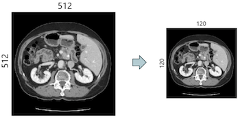
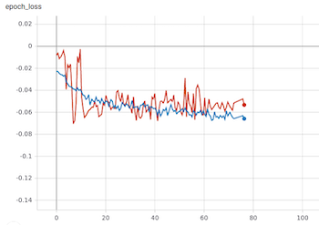

# 
 Pancreas tumor image segmentation 

### 
 UPC Artificial intelligence with Deep Learning Postgraduate Course 

##### 
 Students: Roger Borràs, Jaume Brossa, Cristina De La Torre, Cristian Pachón 

##### 
 Advisor: Santi Puch 

### Motivation

### About Medical Segmentation Datathon

### Input dataset

### Challenges faced
As mention before, the input dataset consisted of 3D images. It meant that **a high amout of time** was needed to
train the model. Since the architecture of the net was quite complex, it took a lot of time **to make the model learn**. In this section, it is described the actions done in order to solve these problems.

#### High amout of time
It was observed the model needed a large amount of time to train. The first hyphotesis was the images were too big. In order to validate this hypotheis, we did the following changes:

* Resizing: It actually lowered the time needed but at the same time, a lot of information was lost. So, we decided not to use it

    

* Crop: Image crop along axes x,y and z. Relevant information was kept and input was smaller. We decided to used it

    

* Patches: Divide the image into patches. It helped tp solved computational problems. We decided to used it

    

#### Making the model learn
It was observed that the model was not learning, since it was assigning all the pixels to the backgroud class. After analysing the dataset, we saw the data was highly unbalanced. The following figures shows the raw image and the cancer:

    

    

As we can see, pancreas tumor is a really small portion of the image. We tested three hypothesis in order to see if the model was able to learn. These were:

* Use a problem-oriented loss function. A lot of papers saig the Generalised Dice Loss (GDL) was the indicated one to use for this problem. After using GLD the model started learning. The formula of this loss is the following one:

* Balance the data in order the have the same amount of pancreas as backgraud. This also helped the model to learn

* Data augmentation: In order to generate different samples of pancreas. Even though it was not necessary (becuase there were a lot of images), we implemented it to learn how to do these transformations.

### Architecture

### Iterations
In order to make small but relevant improvements, several iteration have been done. In this section, we describe them.

##### Overfitting
In order to make the model overfit, the following configuration was used:

* Used binary cross entropy Loss
* Using only 15 patches for training, 5 for validation
* Trained for around 370 epochs (9 hours)

The foloowing figure shows the traning and validation loss:

    

From the previous figure, we can see that from epoch 200 the training loss  is still descending but the validation loss is flat. 

THe following figures shows how the model is overfitted. The firt figure is a prediction for an image from the traning set and the second one is a prediction for an image from the validation set:

    
    
Prediction for a training image

    
    
Prediction for a validation image

Clearly, the model is momorising the training set and, thus, it is unable to predict anything for an unseen image.

#### Using Generalised Dice Loss
After building an onvertiffited case, we changed the loss function. The following configuration was used:

* Used only 15 patches for training, 5 for validation
* Trained for oround 230 epochs (5 hours)
* Used Generalized Dice Loss, which optimum value in our implementation is -1

The following figure shows the training and the validation loss function:

    

The model is slowly learning. In this scenario, there is no overfit, as we can see in the following figures:

    
    
Prediction for a training image

    
    
Prediction for a training image

#### First trial with the whole dataset

#### Second trial with the whole dataset

### Final results
The hyperparameters from our last training were the following:

|          Hyperparameter         |    Value   |
|:-------------------------------:|:----------:|
|           Architecture          |  3D U-Net  |
|      Initial learning-rate      |    0.001   |
|            Batch size           |      2     |
|              Epochs             |     78     |
|         Train patch size        | 128x128x64 |
|      Validation patch size      | 256x256x64 |
|        # images training        |     120    |
|       # images validation       |     30     |
| Background/Pancreas patch ratio |     1.5    |

     

